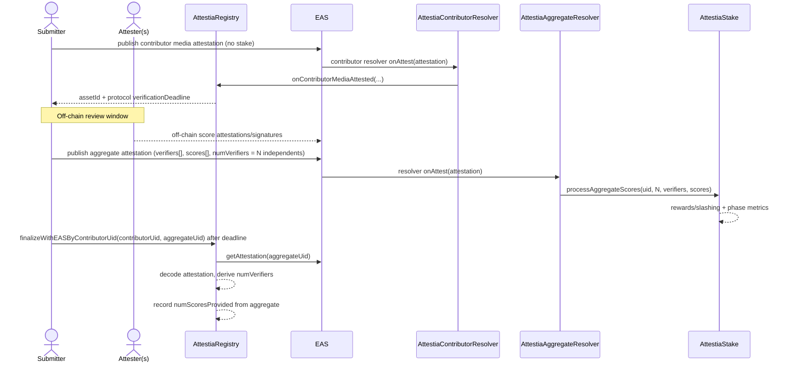
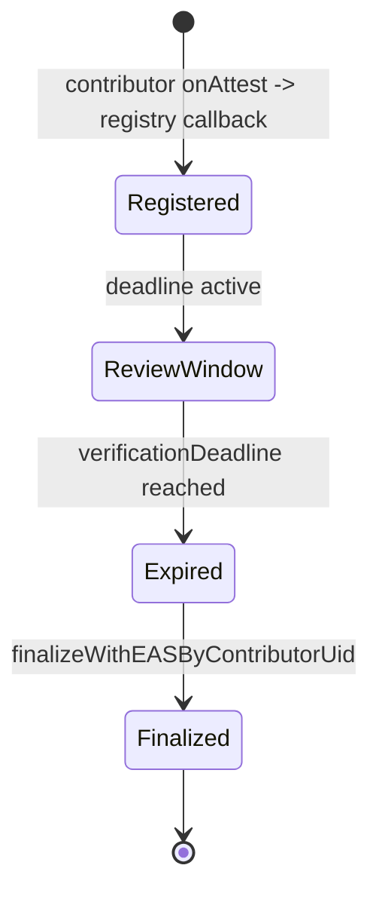

# Attestia contracts

Solidity for `AttestiaStake`, `AttestiaRegistry`, `AttestiaContributorResolver`, and `AttestiaAggregateResolver` (EAS schema resolvers), compiled and tested with [Hardhat](https://hardhat.org/).

## Protocol interactions (quick mental model)

### Who does what

- `AttestiaStake`: participant roles, attester stake, rewards/slashing, and network phase.
- `AttestiaRegistry`: media registration + finalization (contributors do not stake on-chain).
- `AttestiaContributorResolver`: validates contributor membership and forwards contributor media metadata to `AttestiaRegistry`.
- `AttestiaAggregateResolver`: validates aggregate attestation publisher and forwards verifier vectors to `AttestiaStake`.
- `EAS`: attestation storage (contributor media attestation + aggregate attestation payload).

### End-to-end flow



### Function interaction map

- Submitter lifecycle (no on-chain registration):
  - contributor EAS attestation (schema bound to `AttestiaContributorResolver`)
  - resolver callback creates registry media entry (no token transfer)
  - `AttestiaRegistry.finalizeWithEASByContributorUid(contributorUid, aggregateUid)`
- Attester lifecycle (USDC stake; defaults ≈ former ETH at ~$3.5k/ETH):
  - Min stake **350 USDC** (was 0.1 ETH), bounds **175–700 USDC** (0.05–0.2 ETH)
  - Base reward **7 USDC**/round (was 0.002 ETH)
  - Approve `AttestiaStake.stakeToken()` then `stake(amount)` and `registerAsAttester()`
  - aggregate publish triggers `AttestiaAggregateResolver.onAttest(...)`
  - resolver calls `AttestiaStake.processAggregateScores(...)`
- Finalization:
  - `AttestiaRegistry` reads aggregate data from EAS and records **independent** attester count (excludes `AttestiaStake.nativeAttester`). No contributor refunds or fees.
- Native attester:
  - Configure `AttestiaStake.nativeAttester` to the wallet that signs Attestia detector off-chain scores.
  - Aggregate `verifiers[]` may include that address once; `numVerifiers` is the count of independent attesters only.
  - Native score weight `w_A(N)` by independent count **in that aggregate** (not network size): `<5` 80%, `5–9` 50%, `10–14` 30%, `15–20` 20%, `>20` 10% (`setNativeWeightBps`); native is not rewarded or slashed.
  - Deepfake risk scores use **percent × 100** on-chain (e.g. 80.56% → `8056`, max `10000`). Slashing (weak/mature phases only): if consensus &gt; 50% and attester &lt; 45%, or consensus &lt; 50% and attester &gt; 55% (`setDirectionalSlashThresholds`, `setSlashRates`).

### Media state machine



## Prerequisites

- Node.js 20+
- HTTPS RPC URL for Base Sepolia (or Base mainnet)
- ETH on the deployer account for deployment + schema registration txs
- USDC (or configured `stakeToken`) for funding rewards and test stakes on live networks

## Setup

```bash
cd contracts
npm install
cp .env.example .env
```

## Deployment order (contracts + schemas + env vars)

Use this sequence to avoid resolver/schema mismatches.

### 0) Base env (required first)

Set these in `contracts/.env`:

- `PRIVATE_KEY` — deployer key (`0x...`)
- `BASE_SEPOLIA_RPC_URL` — RPC URL
- optional: `STAKE_TOKEN_ADDRESS` (defaults to Circle USDC on Base / Base Sepolia)
- optional: `MIN_STAKE_AMOUNT` (default `350` USDC)
- optional: `BASE_REWARD_PER_ROUND_AMOUNT` (default `7` USDC per scored round)
- optional: `ATTESTIA_NATIVE_ATTESTER` — detector signer wallet (wired to `AttestiaStake.nativeAttester` at deploy)

### 1) Deploy core contracts (`AttestiaStake` + `AttestiaRegistry`)

```bash
npm run deploy:base-sepolia
```

Save outputs:

- `ATTESTIA_STAKE=<AttestiaStake address>`
- `ATTESTIA_REGISTRY=<AttestiaRegistry address>`

Also copy to webapp env later:

- `NEXT_PUBLIC_STAKING_CONTRACT_ADDRESS=<AttestiaStake>`
- `NEXT_PUBLIC_REGISTRY_CONTRACT_ADDRESS=<AttestiaRegistry>`

### 2) Deploy contributor resolver (must happen before contributor schema registration)

Required env before running:

- `ATTESTIA_REGISTRY=<AttestiaRegistry address>`

Run:

```bash
npm run deploy:contributor-resolver
```

Save output:

- `ATTESTIA_CONTRIBUTOR_RESOLVER=<AttestiaContributorResolver address>`

Notes:

- If deployer is registry governance, the script also calls `setContributorResolver`.

### 3) Deploy aggregate resolver (must happen before aggregate schema registration)

Required env before running:

- `ATTESTIA_STAKE=<AttestiaStake address>`

Run:

```bash
npm run deploy:aggregate-resolver
```

Save output:

- `ATTESTIA_AGGREGATE_RESOLVER=<AttestiaAggregateResolver address>`

Notes:

- If deployer owns `AttestiaStake`, the script also sets `performanceReporter` automatically.

### 4) Register EAS schemas (after both resolvers are deployed)

Required env for resolver-bound registration:

- `ATTESTIA_CONTRIBUTOR_RESOLVER=<contributor resolver>`
- `ATTESTIA_AGGREGATE_RESOLVER=<aggregate resolver>`

Register all in one command:

```bash
npm run eas:register-all
```

Or individually:

```bash
npm run eas:register-contributor
npm run eas:register-offchain
npm run eas:register-onchain
```

Copy printed UIDs into `webapp/.env.local`:

- `NEXT_PUBLIC_EAS_SCHEMA_UID_CONTRIBUTOR_MEDIA=...`
- `NEXT_PUBLIC_EAS_SCHEMA_UID_SCORE_OFFCHAIN=...`
- `NEXT_PUBLIC_EAS_SCHEMA_UID=...`
- `EAS_SCHEMA_UID_SCORE_OFFCHAIN=...` (server)
- `EAS_SCHEMA_UID_AGGREGATE_ONCHAIN=...` (server)

## Compile & test

```bash
npx hardhat compile
npx hardhat test
```

## EAS schemas

There are **three** schemas (all registered by `npm run eas:register-all`):

| Schema | Who uses it | Env var |
|--------|-------------|---------|
| **Contributor media (on-chain)** | Contributors attest media metadata | `NEXT_PUBLIC_EAS_SCHEMA_UID_CONTRIBUTOR_MEDIA` |
| **Attester score (off-chain)** | Attesters sign each score | `NEXT_PUBLIC_EAS_SCHEMA_UID_SCORE_OFFCHAIN` (and server `EAS_SCHEMA_UID_SCORE_OFFCHAIN`) |
| **Aggregate (on-chain)** | Submitters publish the rollup on-chain | `NEXT_PUBLIC_EAS_SCHEMA_UID` |

Individual scripts: `eas:register-contributor` (contributor media only), `eas:register-offchain` (score only), `eas:register-onchain` (aggregate only).

## EAS aggregate resolver and on-chain schema

The on-chain aggregate attestation (see `ATTESTIA_ONCHAIN_AGGREGATE_SCHEMA_RAW` in `webapp/src/lib/eas/attestiaSchemas.ts`) can be bound to **`AttestiaAggregateResolver`**, which stores the deployer address and allows only that address to act as **attester** when creating attestations for that schema.

**Order matters:** deploy the resolver first, then register the schema with the resolver address.

### 1. Deploy the resolver

Run this from the same network account that should be the **only** wallet allowed to publish aggregate attestations on-chain (`authorizedAttester` is set to `msg.sender` at deploy time).

Base Sepolia:

```bash
npm run deploy:aggregate-resolver
```

Base mainnet (same script, different network):

```bash
npx hardhat run scripts/deployAggregateResolver.ts --network base
```

The script prints `ATTESTIA_AGGREGATE_RESOLVER=<address>` and confirms `authorizedAttester`.

### 2. Register the schema with the Schema Registry

Add the resolver address to `.env`:

```bash
ATTESTIA_AGGREGATE_RESOLVER=0xYourResolverAddress
```

Register the on-chain aggregate schema (resolver is read from that variable; if it is unset, registration uses the zero address and no attester check):

```bash
npm run eas:register-onchain
```

Or register **all three** schemas at once (contributor on-chain + score off-chain + aggregate on-chain):

```bash
npm run eas:register-all
```

Copy the printed UIDs into `webapp/.env.local` (`NEXT_PUBLIC_EAS_SCHEMA_UID_CONTRIBUTOR_MEDIA`, `NEXT_PUBLIC_EAS_SCHEMA_UID_SCORE_OFFCHAIN`, and `NEXT_PUBLIC_EAS_SCHEMA_UID`).

**Note:** Each registration creates a **new** schema UID. If you change the resolver or re-register, update the web app env to the new UID. Existing attestations keep their original schema UID.

### 3. Verify the resolver (optional)

With `BASESCAN_API_KEY` set:

```bash
npx hardhat verify --network baseSepolia <RESOLVER_ADDRESS> "0x4200000000000000000000000000000000000021"
```

The constructor argument is the EAS contract on Base / Base Sepolia (`0x4200…0021`).

## Verify on Basescan (optional)

Set `BASESCAN_API_KEY` in `.env` (from [Basescan](https://basescan.org/apis)), then:

```bash
npx hardhat verify --network baseSepolia <STAKE_ADDRESS> "<MIN_STAKE_WEI>"
npx hardhat verify --network baseSepolia <REGISTRY_ADDRESS> "<STAKE_ADDRESS>" "0x4200000000000000000000000000000000000021"
```

Use quoted constructor arguments as strings (wei for stake; registry takes stake + EAS address).

## Layout

- `src/` — Solidity sources (`AttestiaStake`, `AttestiaRegistry`, `AttestiaContributorResolver`, `AttestiaAggregateResolver`)
- `test/` — Hardhat + Mocha + Chai tests
- `scripts/deploy.ts` — stake + registry deployment
- `scripts/deployContributorResolver.ts` — contributor resolver deployment + registry wiring
- `scripts/deployAggregateResolver.ts` — EAS aggregate resolver deployment
- `scripts/registerEasOnchainSchema.ts` — register on-chain aggregate schema only (optional resolver via env)
- `scripts/registerEasOffchainSchemas.ts` — register attester off-chain score schema only
- `scripts/registerEasSchemas.ts` — register all three schemas in one run

