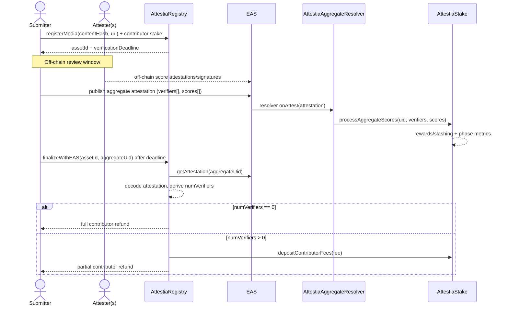
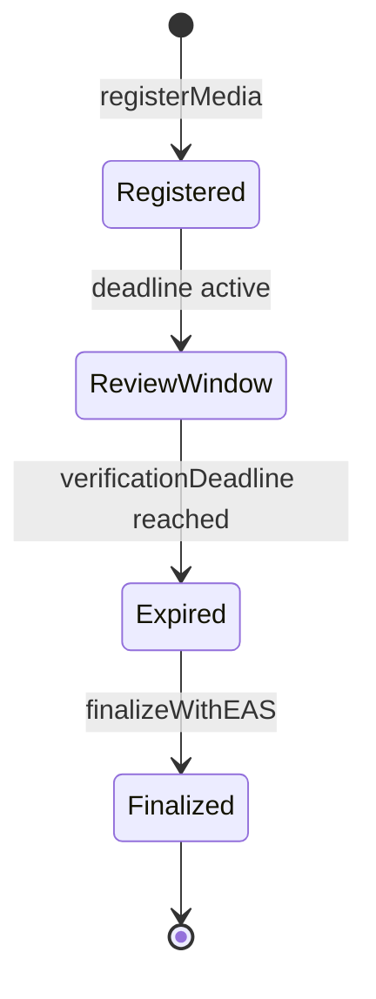

# Attestia contracts

Solidity for `AttestiaStake`, `AttestiaRegistry`, and `AttestiaAggregateResolver` (EAS schema resolver for on-chain aggregate attestations), compiled and tested with [Hardhat](https://hardhat.org/).

## Protocol interactions (quick mental model)

### Who does what

- `AttestiaStake`: participant roles, attester stake, rewards/slashing, and network phase.
- `AttestiaRegistry`: media registration + contributor escrow stake + final settlement/refund.
- `AttestiaAggregateResolver`: validates aggregate attestation publisher and forwards verifier vectors to `AttestiaStake`.
- `EAS`: attestation storage (contributor media attestation + aggregate attestation payload).

### End-to-end flow



### Function interaction map

- Submitter lifecycle:
  - `AttestiaStake.registerAsSubmitter()`
  - `AttestiaRegistry.registerMedia(...)`
  - `AttestiaRegistry.finalizeWithEAS(assetId, aggregateUid)`
- Attester lifecycle:
  - `AttestiaStake.stake()` then `AttestiaStake.registerAsAttester()`
  - aggregate publish triggers `AttestiaAggregateResolver.onAttest(...)`
  - resolver calls `AttestiaStake.processAggregateScores(...)`
- Settlement rule:
  - `AttestiaRegistry` reads aggregate data from EAS and computes `numScoresProvided` on-chain.
  - `numScoresProvided == 0` => full contributor refund.
  - `numScoresProvided > 0` => partial contributor refund + network fee routed to `AttestiaStake`.

### Media state machine



## Prerequisites

- Node.js 20+
- An [Alchemy](https://www.alchemy.com/) (or other) HTTPS RPC URL for Base Sepolia
- **Base Sepolia ETH** on the deployer account ([faucet](https://www.alchemy.com/faucets/base-sepolia))

## Setup

```bash
cd contracts
npm install
cp .env.example .env
```

Edit `.env`:

- `PRIVATE_KEY` — deployer key (`0x…`, 64 hex chars after prefix)
- `BASE_SEPOLIA_RPC_URL` — e.g. `https://base-sepolia.g.alchemy.com/v2/<API_KEY>`

## Compile & test

```bash
npx hardhat compile
npx hardhat test
```

## Deploy (Base Sepolia)

```bash
npx hardhat run scripts/deploy.ts --network baseSepolia
```

Or use the npm script:

```bash
npm run deploy:base-sepolia
```

Defaults: `MIN_STAKE_WEI` = `0.0001` ether if `MIN_STAKE_WEI` is not set in `.env`.

Copy the printed addresses into the web app:

- `NEXT_PUBLIC_STAKING_CONTRACT_ADDRESS` → `AttestiaStake`
- `NEXT_PUBLIC_REGISTRY_CONTRACT_ADDRESS` → `AttestiaRegistry` (optional)

## EAS schemas

There are **two** schemas (both registered by `npm run eas:register-all`):

| Schema | Who uses it | Env var |
|--------|-------------|---------|
| **Attester score (off-chain)** | Attesters sign each score | `NEXT_PUBLIC_EAS_SCHEMA_UID_SCORE_OFFCHAIN` (and server `EAS_SCHEMA_UID_SCORE_OFFCHAIN`) |
| **Aggregate (on-chain)** | Submitters publish the rollup on-chain | `NEXT_PUBLIC_EAS_SCHEMA_UID` |

Individual scripts: `eas:register-offchain` (score only), `eas:register-onchain` (aggregate only).

## EAS aggregate resolver and on-chain schema

The on-chain aggregate attestation (see `ATTESTIA_ONCHAIN_AGGREGATE_SCHEMA_RAW` in `webapp/src/lib/eas/attestiaSchemas.ts`) can be bound to **`AttestiaAggregateResolver`**, which stores the deployer address and allows only that address to act as **attester** when creating attestations for that schema.

**Order matters:** deploy the resolver first, then register the schema with the resolver address.

### 1. Deploy the resolver

Run this from the same network account that should be the **only** wallet allowed to publish aggregate attestations on-chain (`authorizedAttester` is set to `msg.sender` at deploy time).

Base Sepolia:

```bash
npm run deploy:aggregate-resolver
```

Base mainnet (same script, different network):

```bash
npx hardhat run scripts/deployAggregateResolver.ts --network base
```

The script prints `ATTESTIA_AGGREGATE_RESOLVER=<address>` and confirms `authorizedAttester`.

### 2. Register the schema with the Schema Registry

Add the resolver address to `.env`:

```bash
ATTESTIA_AGGREGATE_RESOLVER=0xYourResolverAddress
```

Register the on-chain aggregate schema (resolver is read from that variable; if it is unset, registration uses the zero address and no attester check):

```bash
npm run eas:register-onchain
```

Or register **both** schemas at once (attester off-chain score + on-chain aggregate; only the on-chain row uses `ATTESTIA_AGGREGATE_RESOLVER`):

```bash
npm run eas:register-all
```

Copy the printed UIDs into `webapp/.env.local` (`NEXT_PUBLIC_EAS_SCHEMA_UID_SCORE_OFFCHAIN` and `NEXT_PUBLIC_EAS_SCHEMA_UID`).

**Note:** Each registration creates a **new** schema UID. If you change the resolver or re-register, update the web app env to the new UID. Existing attestations keep their original schema UID.

### 3. Verify the resolver (optional)

With `BASESCAN_API_KEY` set:

```bash
npx hardhat verify --network baseSepolia <RESOLVER_ADDRESS> "0x4200000000000000000000000000000000000021"
```

The constructor argument is the EAS contract on Base / Base Sepolia (`0x4200…0021`).

## Verify on Basescan (optional)

Set `BASESCAN_API_KEY` in `.env` (from [Basescan](https://basescan.org/apis)), then:

```bash
npx hardhat verify --network baseSepolia <STAKE_ADDRESS> "<MIN_STAKE_WEI>"
npx hardhat verify --network baseSepolia <REGISTRY_ADDRESS> "<STAKE_ADDRESS>"
```

Use quoted constructor arguments as strings (wei for stake; registry takes the stake address).

## Layout

- `src/` — Solidity sources (`AttestiaStake`, `AttestiaRegistry`, `AttestiaAggregateResolver`)
- `test/` — Hardhat + Mocha + Chai tests
- `scripts/deploy.ts` — stake + registry deployment
- `scripts/deployAggregateResolver.ts` — EAS aggregate resolver deployment
- `scripts/registerEasOnchainSchema.ts` — register on-chain aggregate schema only (optional resolver via env)
- `scripts/registerEasOffchainSchemas.ts` — register attester off-chain score schema only
- `scripts/registerEasSchemas.ts` — register both schemas in one run

